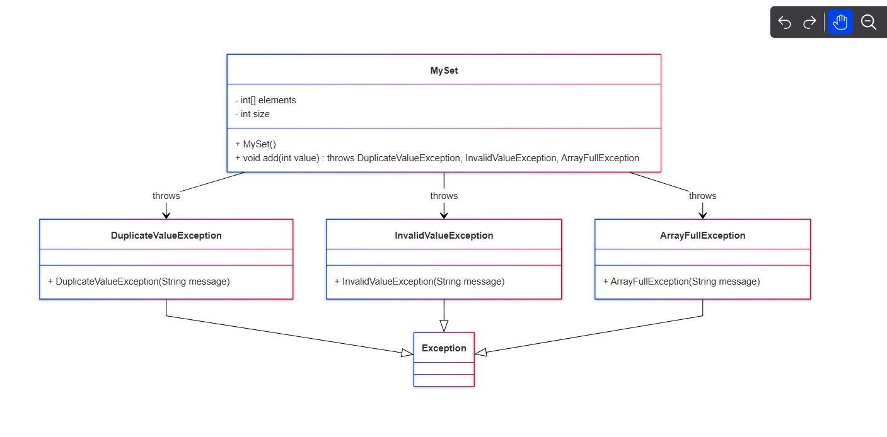

classDiagram
    class MySet {
        - int[] elements
        - int size
        + MySet()
        + void add(int value) throws DuplicateValueException, InvalidValueException, ArrayFullException
    }

    class DuplicateValueException {
        + DuplicateValueException(String message)
    }

    class InvalidValueException {
        + InvalidValueException(String message)
    }

    class ArrayFullException {
        + ArrayFullException(String message)
    }

    MySet --> DuplicateValueException : throws
    MySet --> InvalidValueException : throws
    MySet --> ArrayFullException : throws

    DuplicateValueException --|> Exception
    InvalidValueException --|> Exception
    ArrayFullException --|> Exception

Diagrama:
